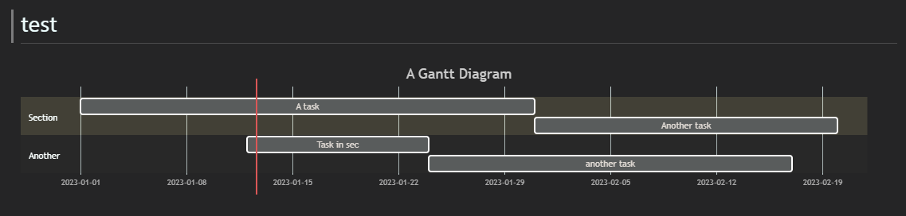
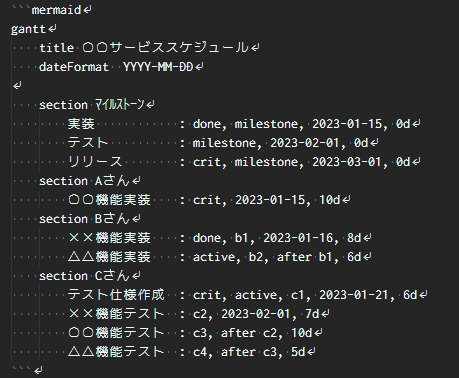
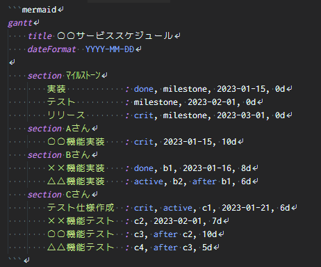
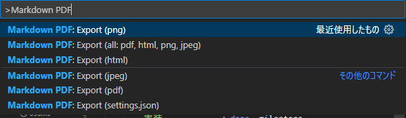

# ①VSCodeでmermaidを利用する方法や便利な拡張機能

引用元　(https://www.engineer-route.com/column/8973/)
引用元　(https://qiita.com/sato_kana/items/2a13f19017576488f017)

## 1,mermaidとは
ダイアグラム作成およびチャート作図用のJavaScriptライラリです。
(https://mermaid-js.github.io/mermaid/)
フローチャート、シーケンス図、ガントチャート、円グラフなどいろいろな図表を作成できます。
作図にはマークダウン記法が利用でき、作図したものはPNG/JPEGで書き出す事もできます。

## 2,VSCodeで使うMermaid
VSCode + Mermaidを利用するとマークダウンで書かれた図表のプレビューや、図表の書き出しができます。
手順書やちょっとした説明の際に図表が使えると分かり易くスッキリとまとめる事ができる為、オススメです。

## 3,VSCode + Mermaidの準備
使用開始までの手順は以下となります。
- [VSCode](https://azure.microsoft.com/ja-jp/products/visual-studio-code/)のインストール
- [Markdown Preview Mermaid Support](https://marketplace.visualstudio.com/items?itemName=bierner.markdown-mermaid)プラグインのインストール
- [Markdown Preview Enhanced](https://marketplace.visualstudio.com/items?itemName=shd101wyy.markdown-preview-enhanced)プラグインのインストール
※必須ではないですが、扱いやすくなります。

以上

## 4,mermaidで使える便利な拡張機能

### Mermaid記法をプレビューに表示する
プレビュー時にMermaid記法で記述したコードを図として表示する拡張機能です。

#### 拡張機能
[Markdown Preview Mermaid Support](https://marketplace.visualstudio.com/items?itemName=bierner.markdown-mermaid)

#### 使い方
拡張機能をインストールするだけで、特に設定を変更することなくプレビュー時に図が表示されるようになります。

### Mermaid記法をハイライト表示
IDEを使っているのであれば、白と黒だけでは味気ないし見づらい、ということで、Mermaid記法をハイライト表示してくれる拡張機能です。

#### 拡張機能
[Mermaid Markdown Syntax Highlighting](https://marketplace.visualstudio.com/items?itemName=bpruitt-goddard.mermaid-markdown-syntax-highlighting)

#### 使い方
この拡張機能もインストールをするだけで使えます。
また、特に設定項目もありません。

- 導入前

- 導入後

このように、導入するだけでMermaid記法をした箇所に色がつくようになり、非常にコードが見やすくなりました。

### Mermaid記法で表示される図を画像やPDFに出力
非エンジニアの方にMarkdownを渡してMermaid記法で書かれた図を見てもらうのは中々ハードルが高いものです。
画像やPDFであれば見てもらいやすい為、エクスポートが出来るようにしてみます。

#### 拡張機能
[Markdown PDF](https://marketplace.visualstudio.com/items?itemName=yzane.markdown-pdf)

#### 使い方
特に設定変更をすることなく使用が出来ます。
出力したいMarkdownファイルを開き、コマンドパレットで出力形式を選択するとMarkdownのあるフォルダにファイルが出力されます。

この拡張機能で対応している出力形式は以下となります。

- HTML
- PNG
- JPEG
- PDF

