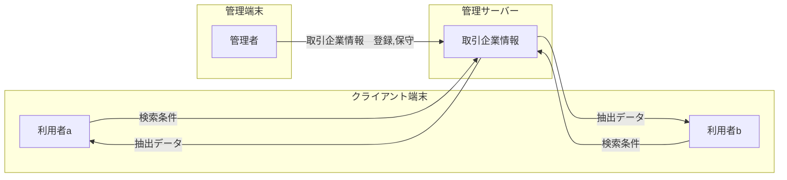

# システム全体図

```mermaid
graph LR
    subgraph クライアント端末
        利用者a
        利用者b
    end
    subgraph 管理サーバー
        取引企業情報
    end
    subgraph 管理端末
        管理者
    end

    利用者a -->|検索条件| 取引企業情報
    取引企業情報---->|抽出データ|利用者a;
    利用者b --> |検索条件|取引企業情報
    取引企業情報---->|抽出データ|利用者b;
    管理者 --> |取引企業情報　登録,保守|取引企業情報
```

#### 利用者操作
- 初めて利用する場合は、ユーザー登録を行う
- ブラウザよりログインして行う
- ブラウザを利用して、情報を入力し情報を所得する

#### 管理者操作
- ブラウザよりログインして行う
- ブラウザより企業情報を登録・保守を行いデータベースを管理する